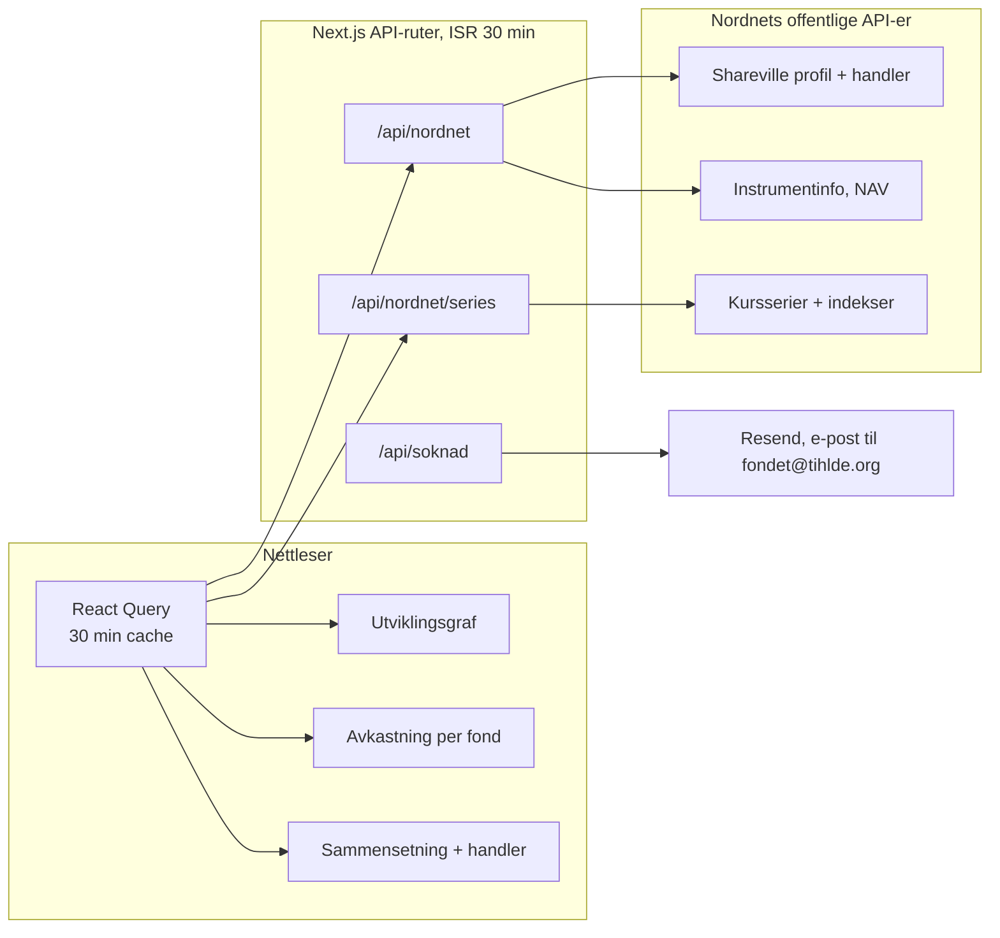
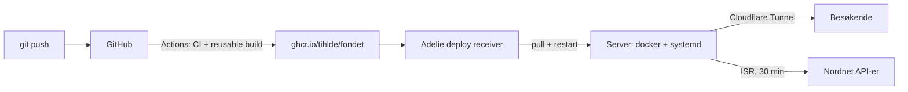
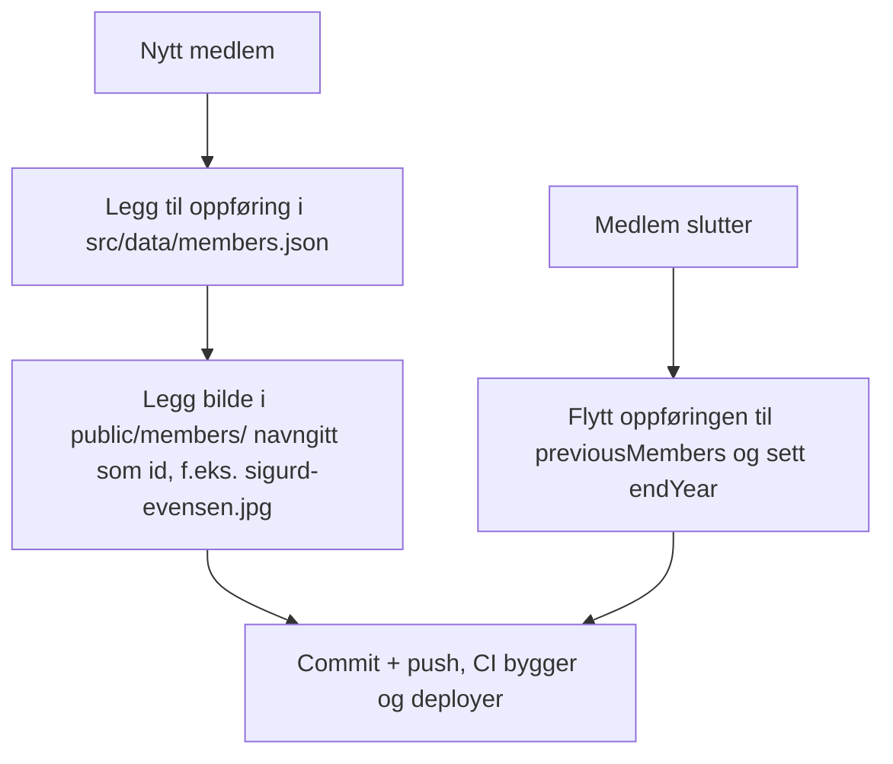

# Fondet, TIHLDE sitt investeringsfond

Nettside for TIHLDE sitt investeringsfond. Viser porteføljen live fra fondets
offentlige Nordnet-profil, medlemmene i forvaltningsgruppen, rapporter og
søknadsskjema for støtte.

Dette dokumentet er skrevet for utviklere som skal videreutvikle eller drifte
siden. Det forklarer ikke bare hva som er bygget, men hvorfor det er bygget
slik, og hvilke avveininger som ligger bak.

Stack: Next.js 15 (App Router), TypeScript, Tailwind CSS v4, React Query,
lightweight-charts (TradingView) og Recharts.

## Idéen bak arkitekturen

Prosjektet er en drift-minimal side som skal overleve at styret og
forvaltningsgruppen skiftes ut hvert år. Det har formet tre valg som resten av
koden henger på.

### 1. Ingen egen database

Alt innhold er enten offentlig data fra Nordnet eller filer: JSON og bilder som
leses fra et montert volum først, med kopiene i repoet som reserve. Det er ikke
fordi en database hadde vært vanskelig, men fordi en database er noe som må
driftes, sikkerhetsoppdateres, migreres og backes opp av folk som byttes ut
årlig. Filer har full historikk i git, kan reviewes i en pull request, og kan
ikke gå ned uten at hele appen gjør det.

Skriveoperasjoner går via adminområdet på `/admin`: forvaltere logger inn med
en engangslenke på e-post (kun @tihlde.org-adresser som står i adminlisten) og
redigerer medlemmer, bilder, rapporter og søknader direkte. Endringene skrives
til volumet, aldri til repoet. De committede filene er utgangspunktet og
reserven, ikke sannheten i produksjon.

### 2. Serveren er eneste vei til Nordnet

Nordnets API-er krever spesielle headere (`client-id`, `Referer`) og tåler ikke
å bli kalt fra nettleseren. API-rutene i Next henter, normaliserer og cacher;
klienten ser bare våre egne typer i `src/lib/nordnet-types.ts`, aldri Nordnets
rå respons.

Poenget er isolasjon: bytter Nordnet API-form, endres ett bibliotek
(`src/lib/nordnet.ts`) og komponentene merker ingenting. Klienten er koblet mot
et stabilt indre grensesnitt, ikke mot en tredjepart vi ikke styrer.

### 3. Ærlig data eller ingen data

Seksjoner uten data skjules i stedet for å vise plassholdere eller eksempeltall.
Et tomt felt er et gyldig utfall; en oppdiktet verdi er det ikke. Dette er en
bevisst regel fordi siden viser et ekte fond med ekte penger, og en pen men
feil graf er verre enn ingen graf.



### Hvorfor to cachelag med samme levetid

Både serveren (ISR) og klienten (React Query) cacher i 30 minutter, og det er
med vilje. De løser to ulike problemer:

- ISR på serveren gjør at Nordnet maksimalt treffes to ganger i timen uansett
  hvor mange som er inne. Det beskytter tredjeparten mot vår trafikk.
- React Query gjør at klienten ikke spør samme side to ganger i samme økt.
  Det beskytter brukeren mot unødige nettverksrunder når de klikker rundt.

Samme tall (30 min) er valgt slik at de to lagene ikke drar i hver sin retning:
klienten ber aldri om ferskere data enn serveren gidder å hente.

## Datakilder

Alt hentes uten innlogging. Integrasjonen ligger i `src/lib/nordnet.ts`.

| Data | Kilde | Merknad |
|------|-------|---------|
| Profil (navn, avatar, følgere, rating) | `api.prod.nntech.io/shareville/v3/profiles/slug/tihlde-forvaltningsgruppen` | Åpen |
| Handler (kjøp/salg) | `api.prod.nntech.io/shareville/v4/profiles/{id}/activity-feed` | Åpen, paginert med `limit`/`offset` |
| Fondsinfo (NAV, avkastning, kategori) | `www.nordnet.no/api/2/instruments/{legacyId}` | Trenger header `client-id: NEXT` |
| Kurshistorikk (fond og indekser) | `api.prod.nntech.io/market-data/v3/price-time-series/period/{PERIOD}/identifier/{uuid}` | Trenger header `Referer: https://www.nordnet.no/`. Fond gir prosent direkte (`?fundType=FUND_NOK`), indekser gir absolutte verdier som omregnes |
| Indeks-oppslag (OSEBX m.fl.) | `www.nordnet.no/api/2/main_search?query=...` | Finner `market_data_order_book_id` ved kjøretid |

### Begrensninger som former designet

- **Hvilke fond som eies utledes fra handelshistorikken:** et fond regnes som
  eid når siste handel i fondet er et kjøp (`getHoldings` i `nordnet.ts`).
  Nordnets API oppgir ikke porteføljen direkte, så vi bygger den fra
  aktivitetsfeeden. Feeden hentes i inntil `FEED_MAX_PAGES` sider; øk den hvis
  et eid fond mangler fordi siste kjøp ligger langt tilbake.
- **Vekter, honorar og referanseindeks kommer fra kvartalsrapportene.**
  `src/lib/fordeling.ts` leser nyeste PDF i `public/reports`, parser hvert fonds
  «Porteføljevekt», «Forvaltningshonorar» og «Referanseindeks», og matcher tallene
  til fondene Nordnet oppgir som eid. En rapport godtas bare hvis vektene summerer
  seg til nær 100 %, slik at halvferdige utkast ikke slår gjennom. Fond kjøpt
  etter siste rapport står uten disse tallene til neste rapport kommer.
- **«TIHLDE-Fondet»-linjen i grafen er et likevektet snitt** av beholdningene
  (`equalWeightComposite` i `src/lib/series.ts`), merket som det i UI-et. Den
  bruker ikke rapportvektene, fordi vektene bare finnes kvartalsvis mens grafen
  er daglig, og en interpolert vektkurve hadde vært en gjetning vi ikke vil vise.

## Sider

| Rute | Innhold |
|------|---------|
| `/` | Profilkort, nøkkeltall, utviklingsgraf med indeks-sammenligning, avkastning per fond og periode, sammensetning, beholdninger og handler |
| `/about` | Om fondet, vedtekter, årsrapporter |
| `/apply` + `/apply/skjema` | Søknad om støtte, sendes som e-post via Resend |
| `/group` + `/group/tidligere` | Forvaltningsgruppen, nåværende og tidligere |
| `/reports` | Rapporter |

## Hosting og deploy

Appen bygges som et Docker-image (`output: "standalone"`) og publiseres til
GitHub Container Registry av TIHLDEs gjenbrukbare GitHub Actions-workflow.
Push til `main` gir taggene `:latest` og commit-SHA. Etter et vellykket bygg
varsles Adelie-mottakeren, som starter deploy av det nye imaget. CI (lint,
typesjekk, tester, build) kjører på alle pusher og pull requests.



Standalone-bygg er valgt fordi det gir et lite image uten `node_modules`, som
starter raskt og ikke trenger en kjørende Node-verktøykjede på serveren.
Deploy-workflowen bruker `DEPLOY_RECEIVER_TOKEN` til å varsle Adelie etter at
imaget er publisert. Mottakeren trekker det nye imaget og restarter tjenesten;
`--pull=always` i systemd-enheten sikrer at `:latest` blir oppdatert.

Dev-miljøet kjører på en hjemmeserver bak Cloudflare Tunnel på
fondet.tritacle.no. Serveren kjører `systemd/fondet.service` som en
brukertjeneste. `RESEND_API_KEY` ligger i `.env` på serveren, aldri i imaget
eller i repoet.

Prod kan settes opp med `:latest`-taggen og registreres hos Adelie-mottakeren.
Vil TIHLDE slippe serverdrift, er Railway nærmeste alternativ: deploy imaget
fra ghcr.io, monter et volum på
`/app/data` og sett miljøvariablene fra `.env.example`. Vercel og Netlify
fungerer ikke, de mangler vedvarende filsystem og adminområdet skriver til
disk.

Volumet (`~/srv/Fondet/data` på serveren, montert som `/app/data`) ser slik ut:

- `members/` - portretter og gruppebilder lastet opp via adminområdet
- `reports/` - opplastede PDF-er, servert via `/api/reports/<fil>`
- `admins.json` - adminlisten, en JSON-liste med e-postadresser
- `members.json`, `content.json`, `soknader.json` - overstyrer kopiene i
  `src/data/` når de finnes

## Vedlikehold av medlemmer

Den vanlige veien er adminområdet: logg inn på `/admin`, rediger medlemmer og
last opp portretter og gruppebilder der. Endringene lagres på volumet og vises
umiddelbart. Git-veien under fungerer fortsatt og er reserven når adminområdet
ikke er tilgjengelig:



- Støttede bildeformater: jpg, jpeg, png, webp. Anbefalt stående 3:4,
  minst 600 px bredt. Oppslaget skjer i `src/lib/member-images.ts` og
  bildene serveres via `/api/members/<fil>`.
- Gruppebilde: legg `group.jpg` (eller png/webp) i samme mappe.
- Mangler bildet, vises en nøytral plassholder. Ingenting knekker.
- I produksjon ligger bildene på et montert volum, ikke i repoet: sett
  `MEMBERS_IMAGE_DIR` til volum-mappen (systemd-enheten monterer
  `~/srv/Fondet/data/members` til `/app/data/members`). Nye bilder legges
  der på serveren, ikke i `public/members`. Er `MEMBERS_IMAGE_DIR` ikke satt,
  brukes `public/members` (lokal utvikling og CI), som også er reserve i
  produksjon slik at allerede committede bilder fortsatt virker.

## Miljøvariabler

Alle er beskrevet i `.env.example`. Lokalt: kopier til `.env.local` og fyll ut
det du trenger. Alt er valgfritt i utvikling; uten `RESEND_API_KEY` logges
innloggingslenken til serverkonsollen i stedet for å sendes.

I produksjon kreves `AUTH_SECRET` (signerer innloggingstokens, generer med
`openssl rand -hex 32`), `APP_BASE_URL` (basis for innloggingslenkene i
e-post) og en adminliste: `ADMIN_EMAILS` eller `admins.json` i `DATA_DIR`
(filen vinner over variabelen).

Merk: Resend sender fra `onboarding@resend.dev` til domenet er verifisert.
Verifiser tihlde.org i Resend-dashbordet for å levere til fondet@tihlde.org.

## Kom i gang

```bash
npm install
npm run dev      # http://localhost:3000
npm run build    # produksjonsbygg
npm run lint
npm test         # vitest
```

## Design og styling

- Tema styres av CSS-variabler i `src/styles/globals.css`. De eksponeres som
  Tailwind-farger i `@theme`-blokken (`bg-cardBackground`,
  `text-foreground-primary` osv.). Bruk alltid disse tokenene, aldri hardkodede
  farger som `text-white`, slik at lyst og mørkt tema følger med automatisk.
- **Tailwind v4-felle:** en fargeutility lages bare når token-navnet i `@theme`
  matcher klassen. Komponentene bruker camelCase-navn (`bg-cardBackground`), så
  `@theme` må definere både kebab-case (`--color-card-background`) og
  camelCase-aliaset (`--color-cardBackground`). Fjerner du aliaset, produserer
  klassen ingen CSS og elementet blir bakgrunnsløst uten noen feilmelding.
- Utviklingsgrafen bruker TradingViews `lightweight-charts`; søylediagram og
  donut bruker Recharts. Grønt for positiv avkastning, rødt for negativ.
- Kjøp/salg og prosenter vises som farget tekst, ikke fargede bokser.
- `⌘K` / `Ctrl+K` åpner hurtigsøket (`src/components/CommandPalette.tsx`) for å
  hoppe mellom sider og bytte tema.
