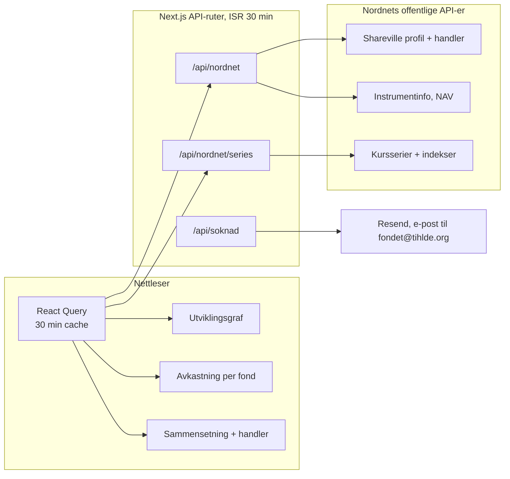
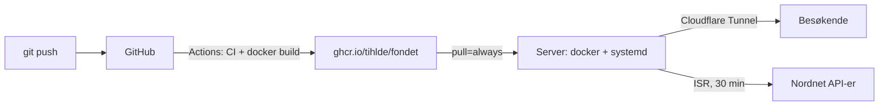
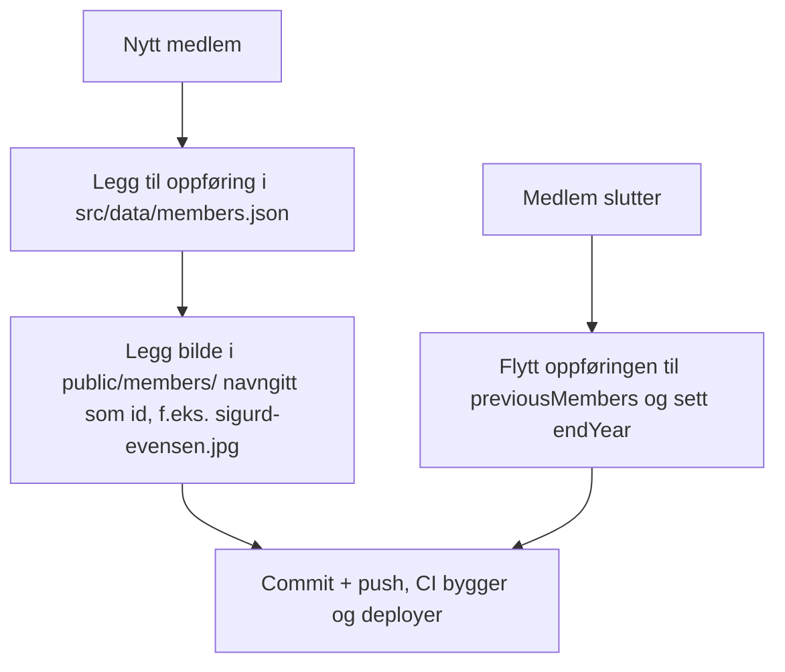

# Fondet, TIHLDE sitt investeringsfond

Nettside for TIHLDE sitt investeringsfond. Viser porteføljen live fra fondets
offentlige Nordnet-profil, medlemmene i forvaltningsgruppen, rapporter og
søknadsskjema for støtte.

Stack: Next.js (App Router), TypeScript, Tailwind CSS, React Query,
lightweight-charts (TradingView) og Recharts.

## Idéen bak arkitekturen

Tre prinsipper styrer alt:

1. **Ingen egen database og ingen innlogging.** Alt innhold er enten offentlig
   data fra Nordnet eller filer i repoet (medlemmer, rapporter). Det finnes
   ingenting å hacke, ingenting å migrere og ingenting som kan gå ned utenom
   selve appen. Endringer i innhold er git-commits med full historikk.
2. **Serveren er eneste vei til Nordnet.** Nordnets API-er krever spesielle
   headere og skal ikke kalles fra nettleseren. API-rutene i Next henter,
   normaliserer og cacher; klienten ser bare våre egne typer. Bytter Nordnet
   API, endres ett bibliotek (`src/lib/nordnet.ts`), ikke komponentene.
3. **Ærlig data eller ingen data.** Vekting er ikke offentlig, så den vises
   ikke. Seksjoner uten data skjules i stedet for å vise plassholdere.



To cachelag med samme levetid (30 min): ISR på serveren gjør at Nordnet
maksimalt treffes to ganger i timen uansett trafikk, React Query gjør at
klienten aldri spør samme side to ganger i samme økt.

## Datakilder

Alt hentes uten innlogging. Integrasjonen ligger i `src/lib/nordnet.ts`.

| Data | Kilde | Merknad |
|------|-------|---------|
| Profil (navn, avatar, følgere, rating) | `api.prod.nntech.io/shareville/v3/profiles/slug/tihlde-forvaltningsgruppen` | Åpen |
| Handler (kjøp/salg) | `api.prod.nntech.io/shareville/v4/profiles/{id}/activity-feed` | Åpen, paginert med `limit`/`offset` |
| Fondsinfo (NAV, avkastning, kategori) | `www.nordnet.no/api/2/instruments/{legacyId}` | Trenger header `client-id: NEXT` |
| Kurshistorikk (fond og indekser) | `api.prod.nntech.io/market-data/v3/price-time-series/period/{PERIOD}/identifier/{uuid}` | Trenger header `Referer: https://www.nordnet.no/`. Fond gir prosent direkte (`?fundType=FUND_NOK`), indekser gir absolutte verdier som omregnes |
| Indeks-oppslag (OSEBX m.fl.) | `www.nordnet.no/api/2/main_search?query=...` | Finner `market_data_order_book_id` ved kjøretid |

**Begrensninger som former designet:**

- **Vekting er ikke offentlig.** Sammensetningen utledes fra handelshistorikken:
  et fond regnes som eid når siste handel i fondet er et kjøp.
- **«TIHLDE-Fondet»-linjen i grafen er et likevektet snitt** av beholdningene,
  merket som det i UI-et. Uten vekter finnes ingen eksakt porteføljekurve.
- Ikke vis plassholder- eller eksempeldata. Tomme seksjoner skjules.

## Sider

| Rute | Innhold |
|------|---------|
| `/` | Profilkort, utviklingsgraf med indeks-sammenligning, avkastning per fond, sammensetning, handler med paginering |
| `/about` | Om fondet, vedtekter, årsrapporter |
| `/apply` + `/apply/skjema` | Søknad om støtte, sendes som e-post via Resend |
| `/group` + `/group/tidligere` | Forvaltningsgruppen, nåværende og tidligere |
| `/reports` | Rapporter |

## Hosting og deploy

Appen bygges som et Docker-image og publiseres til GitHub Container
Registry av GitHub Actions. Push til `dev` gir tag `:dev`, push til
`main` gir `:latest`. CI (lint, typesjekk, tester, build) kjører på
alle pusher og pull requests.



Dev-miljøet kjører på en hjemmeserver bak Cloudflare Tunnel på
fondet.tritacle.no. Serveren kjører `systemd/fondet.service` som en
brukertjeneste: den starter containeren med `--pull=always`, så en
restart av tjenesten henter siste `:dev`-image. `RESEND_API_KEY`
ligger i `.env` på serveren, aldri i imaget eller i repoet.

Prod kan settes opp likt med `:latest`-taggen, eller på Vercel
(importer repoet, sett `RESEND_API_KEY`, ferdig) om TIHLDE heller
vil slippe serverdrift.

## Vedlikehold av medlemmer

Alt styres med filer, ingen admin-innlogging:



- Støttede bildeformater: jpg, jpeg, png, webp. Anbefalt stående 3:4,
  minst 600 px bredt. Oppslaget skjer i `src/lib/member-images.ts` og
  bildene serveres via `/api/members/<fil>`.
- Gruppebilde: legg `group.jpg` (eller png/webp) i samme mappe.
- Mangler bildet, vises en nøytral plassholder. Ingenting knekker.
- I produksjon ligger bildene på et montert volum, ikke i repoet: sett
  `MEMBERS_IMAGE_DIR` til volum-mappen (systemd-enheten monterer
  `~/srv/Fondet/data/members` til `/app/data/members`). Nye bilder legges
  der på serveren, ikke i `public/members`. Er `MEMBERS_IMAGE_DIR` ikke satt,
  brukes `public/members` (lokal utvikling og CI), som også er reserve i
  produksjon slik at allerede committede bilder fortsatt virker.

## Miljøvariabler

Begge er valgfrie. Opprett `.env.local` i rotmappen:

```
# Resend-nøkkel for søknadsskjemaet (gratis: 100 e-poster/dag).
# Uten nøkkel svarer skjemaet med en tydelig feilmelding.
RESEND_API_KEY=

# Mappe med medlems- og gruppebilder, servert via /api/members/<fil>.
# Settes i produksjon til et montert volum. Uten verdi brukes public/members.
MEMBERS_IMAGE_DIR=
```

Merk: Resend sender fra `onboarding@resend.dev` til domenet er verifisert.
Verifiser tihlde.org i Resend-dashbordet for å levere til fondet@tihlde.org.

## Kom i gang

```bash
npm install
npm run dev      # http://localhost:3000
npm run build    # produksjonsbygg
npm run lint
```

## Design

- Tema styres av CSS-variabler i `globals.css` og eksponeres via
  `tailwind.config.ts` (`bg-cardBackground`, `text-foreground-primary` osv.).
  Bruk alltid tokens, aldri hardkodede farger som `text-white`.
- Utviklingsgrafen bruker TradingViews `lightweight-charts`, søylediagram og
  donut bruker Recharts. Grønt for positiv avkastning, rødt for negativ.
- Kjøp/salg og prosenter vises som farget tekst, ikke fargede bokser.
